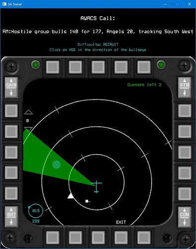

# Situational Awareness Trainer - HSD only version

### Inspiration:
Building a mental 3D map of the position of threat aircraft in the 3D space around you is vitally important as a fighter pilot. Learning to do that in a combat environment is very difficult so I built this training tool to allow virtual pilots to practice translating AWACS threat calls, with the information in the cockpit, into a picture of the threats in a safe controlled environment. This tool replicates the Horizontal Situation Display (HSD) and allows the user to combine the bullseye information in the HSD with the AWACS info in a safe environment. This set up allows a realistic training environment without the threats and time pressure of the actual in game environment.

I'm a founding member of the 72nd Ghosts. Find out more here [72nd Ghosts Homepage](http://72-ghosts.com/)

*This tool is still under active development*

### Techniques used/Learnings:
- Developed trigonometry based functions to determine the relative positions, distances of the various aircraft so they can be plotted on the cockpit display 
- OOP design principles - Inheritance, polymorphism, composition
- Integrating SDL, PLOG and the GoogleTest framework into the codebase
- Using Smartpointers, managing header files (circular dependencies), state machines to control game state/flow/difficulty

### Languages/Packages:
- Visual Studio 2019
- C++ 11 features (complied against C++20 standard)
- [PLOG](https://github.com/SergiusTheBest/plog)
- [SDL](https://www.libsdl.org/)

### Images

